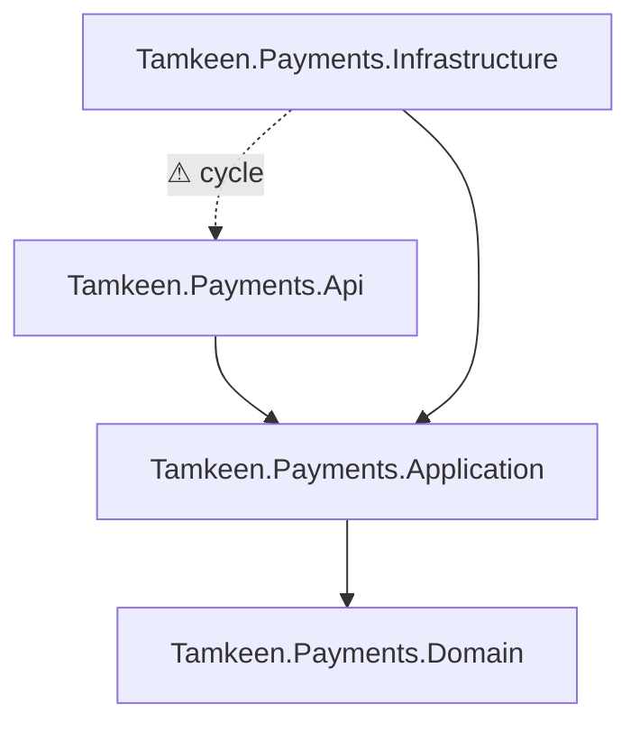
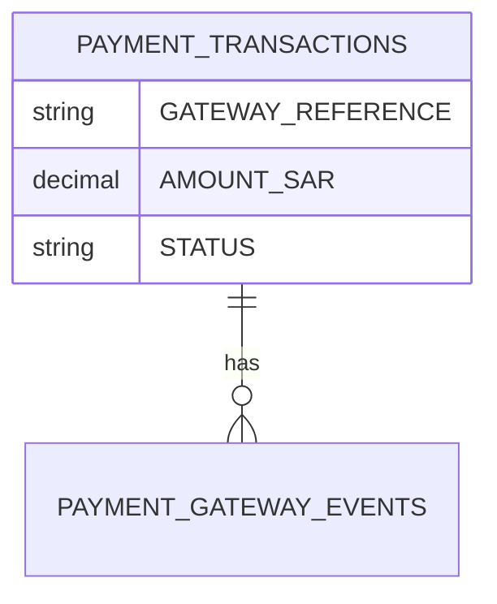

# Skill: architecture-map-gen

**Invocation:** `/architecture-map-gen [type] [scope]`
Example: `/architecture-map-gen dependency-graph` · `/architecture-map-gen erd Tamkeen.Payments` · `/architecture-map-gen c4 full`

Types: `dependency-graph` | `erd` | `service-map` | `service-interaction` | `data-flow` | `c4` | `sequence` | `all`

---

## Overview

**Memory references:** `.cursor/cache/repo-map.json` (from `repo-discovery` —
Step 0 freshness check applies, same as every other consumer), `memory-bank/architecture.md`
for the human-authored layer names/boundaries to label diagrams with (so a
generated diagram says "Application layer" the way this team says it, not a
generic Clean Architecture label).

This is Phase 10's gap: `docs-guard`, `onboarding-doc-gen`, `changelog-gen`,
and `release-notes-gen` all generate prose documentation, but nothing in the
workspace turns the structural truth `repo-discovery` already computes into
visual artifacts. `architecture-map-gen` is intentionally thin — it does
**no discovery of its own**, it only renders what `repo-map.json` already
contains. If a diagram looks wrong, the fix is in `repo-discovery`'s scanning
logic, not in this skill's rendering logic.

All output is Mermaid by default (renders natively in GitHub, GitLab, and
most markdown viewers without a plugin) — PlantUML or a literal C4 model
(`structurizr` DSL) only on explicit request, since Mermaid is the lowest
friction for a team that wants diagrams to stay in version control and stay
readable in a PR diff.

---

## Steps

**Step 0 — Confirm `repo-map.json` is fresh.** Same freshness check as every
other consuming skill (see `repo-discovery` Step 0). Refuse to generate a
diagram from stale data without saying so — a wrong architecture diagram is
worse than no diagram, since people trust diagrams more than they verify them.

**Step 1 — `dependency-graph` type.**

Render `repo-map.json`'s `dependencyGraph` as a Mermaid `graph TD`, one node
per project, edges for project references, colored by layer (using
`architecture.md`'s actual layer names). Cycles (already flagged by
`repo-discovery`) are rendered with a distinct red/dashed edge style and
listed separately below the diagram — don't bury them inside a 200-node graph
where they're easy to miss.

For repos with 100+ projects, generate per-bounded-context subgraphs instead
of one flat graph (group by the top-level folder/namespace segment) and
offer a `--full` flag for the complete (likely unreadable without zooming)
version.

**Step 2 — `erd` type.**

From `repo-map.json`'s `dataAccess.efCoreContexts` (entity configurations)
plus the catalog metadata already gathered by `database-audit`/`dotnet-schema-diff`
for non-EF tables, render a Mermaid `erDiagram`:

Mark tables only reachable via Dapper (no EF Core entity) with a distinct
note — they're real ERD nodes but their column list comes from catalog
metadata rather than C# entity configuration, which is itself a useful
signal for `database-audit` to cross-check.

**Step 3 — `service-map` type.**

Render messaging/event relationships (`repo-map.json`'s `messaging` field) as
a Mermaid graph: which services publish which events, which consume them,
direction of the FulfillmentSaga-style choreography where applicable. This
is the diagram most likely to catch an orphaned consumer or a publisher with
no subscriber — flag both as findings, not just draw the graph.

**Step 3b — `service-interaction` type (added Phase 5).**

A variant of `service-map` focused on synchronous calls rather than async
messaging — which services call which other services' HTTP APIs directly,
sourced from `repo-map.json`'s detected `IHttpClientFactory`/typed-client
registrations rather than messaging config. Rendered as a separate diagram
from `service-map` since sync and async coupling have different operational
implications (a synchronous call chain is a cascading-failure risk in a way
an async event isn't) and conflating them in one diagram obscures that
distinction.

**Step 3c — `data-flow` type (added Phase 5).**

Traces how data moves through the system for a named flow (e.g. "payment
data flow from API ingress to settlement"), combining `service-interaction`'s
sync edges and `service-map`'s async edges with the data-access layer from
`database-audit`/`repo-map.json` — which service writes to which table,
which table feeds which downstream read. Always scoped to a specific named
flow on request, never auto-generated for the whole repo at once (a
whole-repo data-flow diagram is usually unreadable and duplicates
`dependency-graph` without adding clarity — say so if asked for one).

**Step 4 — `c4` type.**

Generate Mermaid's `C4Context`/`C4Container` diagram type for the two
standard C4 levels (Context, Container) — Component-level C4 is intentionally
out of scope, since at this repo's scale it would duplicate the
dependency-graph output without adding clarity. State that explicitly rather
than silently generating something low-value.

**Step 5 — `sequence` type.**

Only generated on request for a *specific* flow (e.g. "refund processing
sequence"), not auto-generated for every endpoint — sequence diagrams are
expensive to keep accurate and most valuable for the handful of genuinely
non-obvious cross-service flows (anything touching `FulfillmentSaga`).
Source: the matched handler chain from `pattern-finder` plus messaging
relationships from Step 3.

**Step 6 — Output placement.**

Diagrams go in `.cursor/docs/architecture/` as standalone `.md` files (one
per diagram type/scope) by default — not inline-only in chat — since these
are meant to be committed and referenced from `architecture.md` /
`onboarding-doc-gen` output, not regenerated from scratch every time someone
asks "what does this look like." Link back to them from `architecture.md`
rather than duplicating their content there.

---

## Example Invocation

**Command:** `/architecture-map-gen erd Tamkeen.Payments`

**Context:** Onboarding documentation for a new team member joining the
payments platform.

Agent confirms `repo-map.json` freshness, pulls `PaymentsDbContext`'s 12
entities plus 3 Dapper-only tables found via `database-audit`'s last run,
renders the ERD with the Dapper-only tables marked, writes
`.cursor/docs/architecture/erd-tamkeen-payments.md`, and reports it's ready
to link from `onboarding-doc-gen`'s output.

---

## Output

- One or more Mermaid `.md` files under `.cursor/docs/architecture/`
- A short chat summary of what was generated and any structural findings
  surfaced along the way (cycles, orphaned consumers, Dapper-only tables)
- Findings handed to the relevant audit skill (`02-dotnet-architecture-guard.mdc`
  for cycles, `database-audit` for Dapper/EF gaps) rather than this skill
  judging them itself
