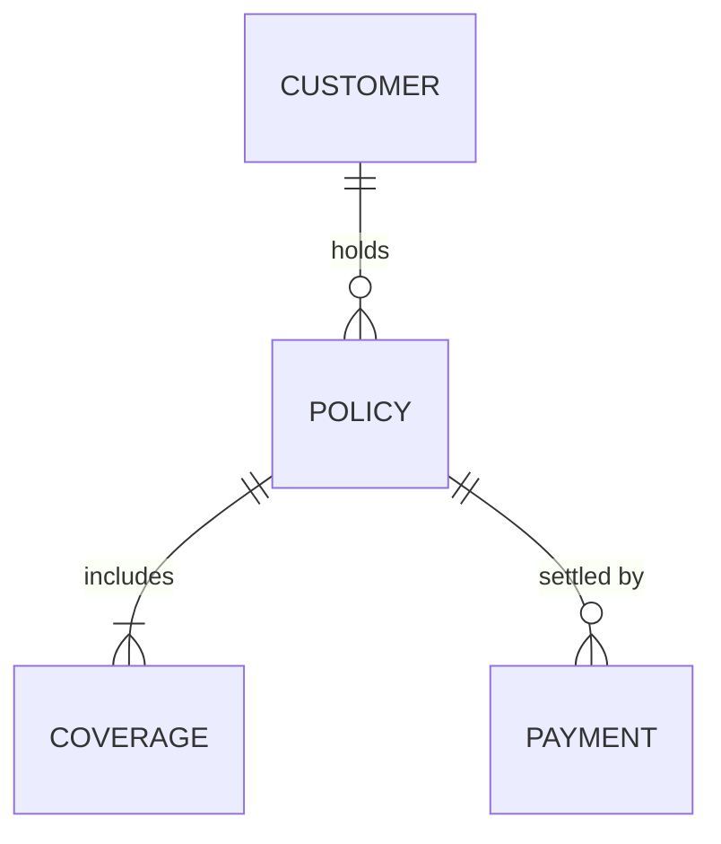

<!-- GENERATED from the cursor-platform source skill "domain-model-gen".
     Do not edit here - edit the source and re-run the plugin build. -->

# Skill: domain-model-gen

**Invocation:** `/domain-model-gen`

---

## Overview

**Memory references:** `memory-bank/businessRules.md, memory-bank/glossary.md, memory-bank/databaseConventions.md`

`domain-model-gen` derives the domain model from the story map — entities,
aggregates, the boundaries that own each transaction, and the invariants that
must hold — and emits it as a Mermaid ERD beside the prose. It is deliberately
separate from `/data-model-design` in phase 3: this describes the business as it
would exist without any software, so that the physical schema later has
something to be a design *of*. Getting these two the wrong way round produces a
domain shaped like a database, which models the storage rather than the business
and is invisible until the first rule that will not fit.

---

## Steps

**Step 1 — Read the story map and personas.**

`docs/product/story-map.md`, `personas.md`, `prd.md`. Stop if the requirements
gate has not passed — modelling a domain from unapproved requirements means
doing it twice.

**Step 2 — Harvest nouns, then reject most of them.**

Every noun in a story is a candidate. Keep one only if it has identity that
matters (two of them can be told apart and someone cares), a lifecycle (it
changes state over time), or rules that constrain it. Everything else is an
attribute or a screen label.

**Step 3 — Find the aggregate boundaries.**

For each cluster ask: what must change together, atomically, or the business is
in an invalid state? That cluster is an aggregate; the entity outsiders reference
is its root.

This is the hardest judgement in the phase and the most expensive to get wrong —
it decides transaction scope, and phase 4 discovers a bad boundary only under
concurrency in production. Where it is genuinely ambiguous, use
`/speckit-options` rather than picking silently.

**Step 4 — Write the invariants as checkable conditions.**

Each gets an ID, and states a condition that is either true or false at a
specific moment.

```
INV-03  A Policy may not transition to Issued while any linked Payment
        is in state Pending or Failed.
```

Not "policies should be paid before issue". Phase 5 will write a test citing
`INV-03`; it needs something to assert.

**Step 5 — Type the attributes that matter.**

Money is `decimal` with a stated currency, always — the audit-trail guard will
enforce it, but only if the model said so. Dates state whether they carry a time
zone. Identifiers state their generation strategy. Enumerations list their values
and say whether the list is closed.

**Step 6 — Mark audit-required entities.**

Anything whose mutation must record who, when and what changed. This flag becomes
a row in `memory-bank/businessRules.md` at the Gate 2 promotion, and from there
rule `07-audit-trail-guard` enforces it on every handler that touches the entity.

**Step 7 — Write `docs/analysis/domain-model.md`.**

Prose sections per aggregate, then the ERD:

````markdown
## Aggregate: Policy
**Root:** Policy   **Audit required:** yes   **Invariants:** INV-01, INV-03

| Attribute | Type | Notes |
|---|---|---|
| PolicyNumber | string(20) | business key, generated on issue |
| Premium | decimal(18,3) | SAR |

**Referenced by:** Claim (by PolicyNumber, not by identity)


````

Mermaid rather than an image: it diffs, it reviews, and `/architecture-map-gen`
already emits it, so the toolchain is consistent.

**Step 8 — Check for orphans, both directions.**

Every entity appears in at least one use case and one relationship; every story
noun that was kept is in the model. Report both — they are Gate 2 blockers.

---

## Front-matter — required on every document this skill writes

Open each file with this block. It is the machine-readable half of a
human-written document: the prose stays prose, and `artifact-schema.mjs` reads
this to know what the document is and where it sits in the chain.

```yaml
---
type: domain-model
phase: ANALYSIS
defines: [INV]
traces: [<repo-relative paths of the documents this was derived from>]
owner: business-analyst
---
```

`defines` names the ID prefixes this document **owns**. It is what stops the
first cell of a traceability table being mistaken for a second definition — a
citation of `S-1` in a use-case table is a reference, not a redeclaration.

Validate before reporting done:

```bash
node ${CLAUDE_PLUGIN_ROOT}/tools/artifact-schema.mjs validate
node ${CLAUDE_PLUGIN_ROOT}/tools/artifact-schema.mjs check
```

`check` fails on an ID cited but never defined, and on a chain that stops — a
requirement no story implements, a story no use case covers, a use case no
endpoint serves. Those are gate criteria, computed rather than judged, and
`lifecycle.mjs check` now fails on them too.

---

## Output

- `docs/analysis/domain-model.md` with an embedded Mermaid ERD
- Terminal: orphan entities, untyped money fields, aggregates with no invariant

